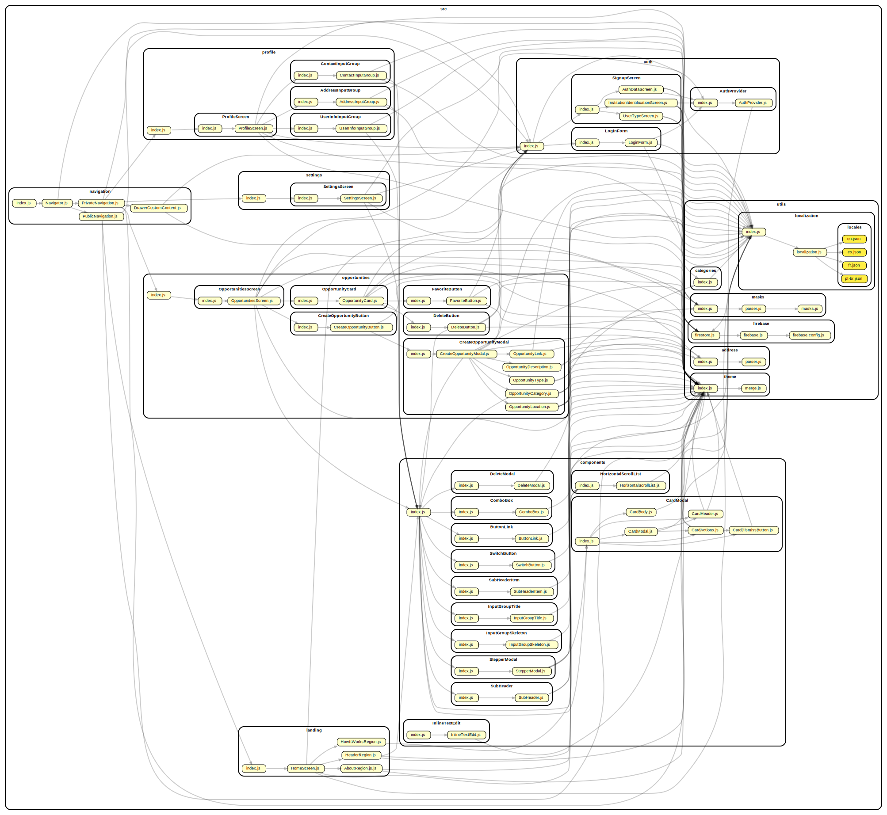

# Rede Refugia

## Dependencies
- [Node](https://nodejs.org/) **(16.14.0)**
- [React Native](https://reactnative.dev/) **(0.64.3)**
- [Expo CLI](http://expo.dev/) **(5.2.0)**
- [Firebase](https://firebase.google.com/) **(9.6.8)**

## Setup Environment

Install Expo CLI globally ([more details](https://docs.expo.dev/get-started/installation/))

```sh
npm install --global expo-cli
```

Install Firebase globally ([more details](https://firebase.google.com/docs/cli/))

```sh
npm install -g firebase-tools
```

### Environment Variables

This project uses the dotenv module to manage its variables. In order to work properly, it should have a `.env` file in the root folder with the following variables:

- API_KEY=XXXXXXXXXXXXXXXXXXX
- AUTH_DOMAIN=XXXXXXXXXXXXXXXXXXX
- PROJECT_ID=XXXXXXXXXXXXXXXXXXX
- STORAGE_BUCKET=XXXXXXXXXXXXXXXXXXX
- MESSAGING_SENDER_ID=XXXXXXXXXXXXXXXXXXX
- APP_ID=XXXXXXXXXXXXXXXXXXX
- MEASUREMENT_ID=XXXXXXXXXXXXXXXXXXX
- GOOGLE_MAPS_DOMAIN=https://maps.googleapis.com/maps/api
- GOOGLE_MAPS_KEY=XXXXXXXXXXXXXXXXXXX

**Obs.:** The Google Maps API only works because there is an API setup in the `web/index.html` file. Make sure that the data in the line `66` is correctly set.

## Install Dependencies

```sh
npm install
```

## Run

```sh
npm start [--clear]
```
Follow the instructions in the terminal. When the environment is ready, you can type `w` in the terminal to start the web application locally.

## Build

### Web

```sh
npm run build:web
```
All static files will be generated and stored in the `web-build` folder at the root directory.

### Android

```sh
npm run build:web
```

## Deploy

```sh
firebase deploy --only hosting
```

This command must be executed after the web build step. It'll deploy all contents of the `web-build` folder to the firebase logged account.

## Dependency Graph

